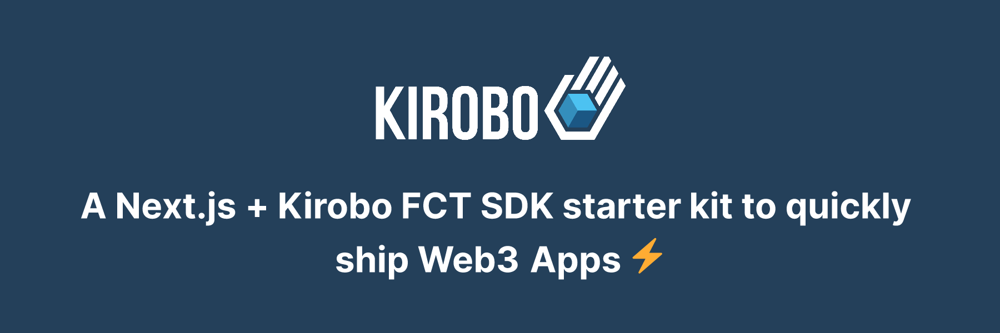

# Kirobo FCT SDK starter

A Next.js + Kirobo FCT SDK starter kit to quickly ship Web3 Apps ⚡



## Getting Started 👀

Check-out the [FCT platform documentation](https://kirobo.gitbook.io/fct-platform/overview/introduction) and the [live demo](https://ki-fct-sdk-starter.vercel.app/) to see how you can use this starter kit.

## Features ✅

- [Next.js](https://nextjs.org/docs)
- [Kirobo SDK](https://github.com/kiriboio/ki-fct-sdk)
- [Chakra UI](https://chakra-ui.com/)
- [ethers.js](https://docs.ethers.org/)
- [wagmi](https://wagmi.sh/)
- [ConnectKit](https://docs.family.co/connectkit/)
- [Sign-In with Ethereum](https://www.login.xyz/)
- [usehooks-ts](https://usehooks-ts.com/)
- [next-SEO](https://github.com/garmeeh/next-seo)

## Developer Experience 🧰

- [TypeScript](https://www.typescriptlang.org/)
- [eslint](https://eslint.org/)
- [prettier](https://prettier.io/)
- [Husky](https://typicode.github.io/husky/)

## Development 🛠️

```bash
npm run dev
# or
yarn dev
```

## Deploy on Vercel 🚢

The easiest way to deploy your Next.js app is to use the [Vercel Platform](https://vercel.com/new) from the creators of Next.js.

Check out our [Next.js deployment documentation](https://nextjs.org/docs/deployment) for more details.

---

Thank you [wslyvh](https://github.com/wslyvh/nexth) for providing a solid foundation for this starter.
